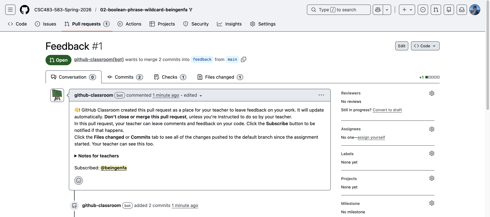
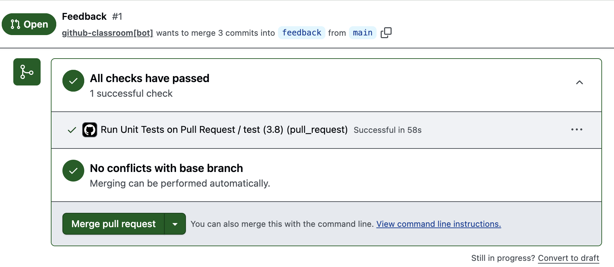

## Setup Instructions

#### Setup Your Environment

You will need to set up an appropriate coding environment on whatever computer you expect to use for this assignment. You will need:
 
* [git](https://git-scm.com/downloads/)
* [Python (3.8 or higher)](https://www.python.org/)
* [Pytest](https://docs.pytest.org/en/stable/)

#### Github Setup

When you accepted the homework assignment, GitHub Classroom has automatically created a repository for you with an open pull request (PR) named "Feedback #1". 
This PR is where you'll see your automated test results.

**Unlike the previous homework, you only need to clone the repo and push changes to `main`. No need to create any branches or pull requests.**



#### Local Setup

1. Go to the repository that GitHub Classroom created for you. It should look like:
   ```
   https://github.com/CSC483-583-Spring-2026/02-boolean-phrase-wildcard-<your-username>
   ```
   where `<your-username>` is your GitHub username.

2. Clone the repository to your local machine:
   ```bash
   git clone https://github.com/CSC483-583-Spring-2026/02-boolean-phrase-wildcard-<your-username>.git
   cd 02-boolean-phrase-wildcard-<your-username>
   ```

## Write Your Code

Follow the instructions given in `homework/tfidf_engine.py` 

**Do not edit these files:**
- `.github/workflows/run-tests-on-pull.yml`
- `docs/*`
- `homework/test_boolean_queries.py`
- `homework/requirements.txt`
- `homework/tests/*`
- `homework/pytest.ini`
- `homework/wiki-small.txt`

**Note:** The file `wiki-small.txt` is the input file you must use to build the index as per HW1 guidelines. Do not edit or move it.

## Test Your Code

Public tests are provided in `homework/tests` directory. To run all tests, execute `pytest` from the command line in the directory containing `homework/`.

If your code passes the public tests, you will see output like:
```terminaloutput
$<your dir>/homework % pytest
================================================================ test session starts =================================================================
platform darwin -- Python 3.9.16, pytest-7.4.2, pluggy-1.3.0
rootdir: <your-root_dir>/homework
configfile: pytest.ini
testpaths: tests
collected 6 items                                                                                                                                    

tests/test_boolean_queries.py ......                                                                                                           [100%]

================================================================= 6 passed in 0.27s ==================================================================
                      
```

## Submitting Your Code

As you work on the code, regularly `git commit` to save your changes locally and `git push` to push all saved changes to the remote repository on GitHub:

```bash
git add .
git commit -m "Your descriptive commit message"
git push origin main
```

## Verify Your Submission

1. Go to the "Feedback #1" pull request in your repository.
2. Click on the "Files changed" tab and verify all your changes look correct.
3. Check that the public automated tests pass via [GitHub Actions](https://github.com/features/actions). 
      - **Successful Undergraduate & Graduate submissions:**
         You should see that all public checks are passed for successful submission.
         

You must also submit answers to the written questions on Gradescope.

## Grading

The programming portion of this assignment will be graded on your code's ability to pass the public tests provided to you **and hidden test cases not visible to you**.

- Assignments that pass all tests with correct logic will receive at least 95% of possible points.
- The remaining points depend on code readability and quality.
- **There will be a penalty for not following submission instructions.**

**Do not merge the pull request.**
